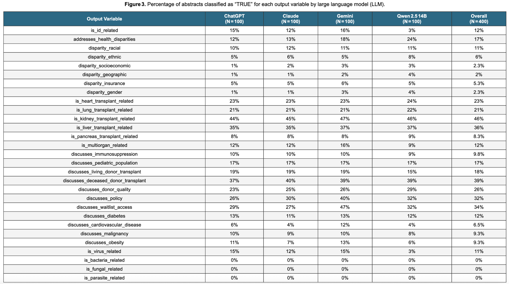

# Ellmer Pubmed ATC 2026 abstract

We used large language models to analyze 100 PubMed abstracts related to
the transplant database Scientific Registry of Transplant Recipients
(SRTR).

The abstracts were pulled into R via the `easyPubMed` package.

``` r
query <- "SRTR AND transplant AND outcomes"
```

We then built a classifier using the `ellmer` R package:
(<https://github.com/VagishHemmige/Ellmer-Pubmed-ATC-2026-abstract/blob/master/R/abstract-schema.R>)

We ran the classifier on the 100 abstracts using four LLMs: 

We then evaluated the concordance between models  
